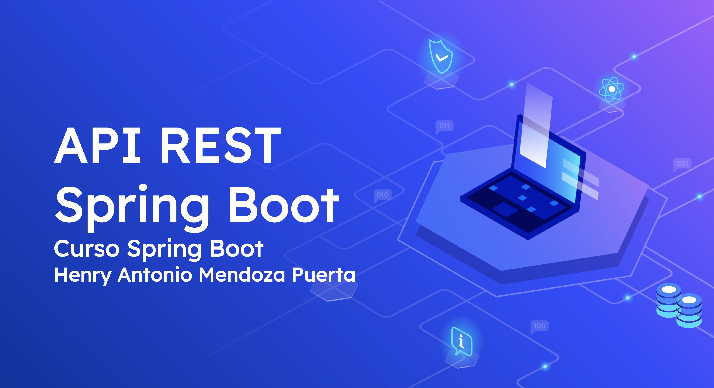

# Curso-DesarrolloWeb-SpringBoot

En este curso vas aprender a implementar una API REST con Spring boot,Spring Data JPA y Spring Security. Desarrollare paso a paso un proyecto desde cero.

## Videos
https://bit.ly/2RNwWNO

## Requisitos
* Java 8 o 11
* Spring Boot 2
* Maven
* PostgreSQL
* Postman
